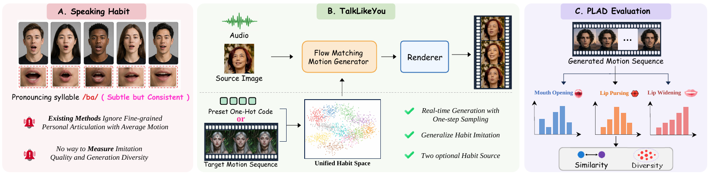

# Talk Like You

Official implementation of **Talk Like You: Imitating How You Speak in Real-Time Talking Head Generation**.

[Baiqin Wang](https://scholar.google.cz/citations?user=pBF9Mn8AAAAJ&hl=zh-CN&oi=ao), Zhixing Ding, Jijie Li, Jiankuo Zhao, [Zhen Lei](https://scholar.google.cz/citations?hl=zh-CN&user=cuJ3QG8AAAAJ), [Xiangyu Zhu](https://xiangyuzhu-open.github.io/homepage/)

MAIS, Institute of Automation, Chinese Academy of Sciences; University of Chinese Academy of Sciences; CAIR, HKISI, Chinese Academy of Sciences; Macau University of Science and Technology

[](https://bq-wang0511.github.io/TalkLikeYou/)
[](https://huggingface.co/doubi-killer/TalkLikeYou)

## Introduction

TalkLikeYou imitates a target person's speaking habits for real-time audio-driven talking-head generation. It uses a one-step Flow Matching Motion Generator in an 18-dimensional lip-motion space and supports either a preset habit ID or a reference video.

<p align="center">
  
</p>

## To do List

- [x] Release Inference Code
- [x] Release Checkpoint
- [ ] Release Streaming RealTime Demo
- [ ] PLAD Evaluation

## Installation

The recommended environment is Linux, Python 3.10, CUDA 12.1, cuDNN 9, and an NVIDIA GPU with at least 12 GB of memory. FFmpeg must be available on `PATH`.

```bash
conda env create -f environment.yaml
conda activate talklikeyou
```

Alternatively, install a CUDA-compatible PyTorch build and then run:

```bash
pip install -r requirements.txt
```

## Checkpoints

Download the inference weights from [Hugging Face](https://huggingface.co/doubi-killer/TalkLikeYou) into the repository root:

```bash
hf download doubi-killer/TalkLikeYou --include "checkpoints/**" --local-dir .
```

The downloaded files must retain their `checkpoints/` paths. This directory is excluded from the code repository. Some third-party weights are restricted to research or non-commercial use; see [THIRD_PARTY_NOTICES.md](THIRD_PARTY_NOTICES.md).

## Inference

Run commands from the repository root. Recommended preset IDs are `192`, `166`, and `202`.

### Image source with a preset habit

```bash
CUDA_VISIBLE_DEVICES=0 python -m talklikeyou \
  --source examples/source.jpg \
  --audio examples/audio.wav \
  --person-id 192 \
  --motion-scale 1.0 \
  --guidance-scale 1.3 \
  --sampling-steps 1 \
  --output outputs/preset_192.mp4
```

### Image source with a reference habit

```bash
CUDA_VISIBLE_DEVICES=0 python -m talklikeyou \
  --source examples/source.jpg \
  --audio examples/audio.wav \
  --habit-reference examples/habit_reference.mp4 \
  --motion-scale 1.0 \
  --guidance-scale 1.3 \
  --sampling-steps 1 \
  --output outputs/reference_habit.mp4
```

The reference video must contain at least 100 frames. It overrides `--person-id` when provided.

### Video source

A source video does not require a habit-reference video.

```bash
CUDA_VISIBLE_DEVICES=0 python -m talklikeyou \
  --source path/to/source.mp4 \
  --audio path/to/audio.wav \
  --person-id 166 \
  --motion-scale 1.0 \
  --guidance-scale 1.3 \
  --sampling-steps 1 \
  --output outputs/dubbed.mp4
```

Each command produces only one final MP4. If `--output` is omitted, a randomly named video is written to `outputs/`. Input and reference videos should use 25 FPS.

## License

The TalkLikeYou code is released under the [MIT License](LICENSE). Third-party code and model files remain subject to their original licenses and usage terms; see [THIRD_PARTY_NOTICES.md](THIRD_PARTY_NOTICES.md).
